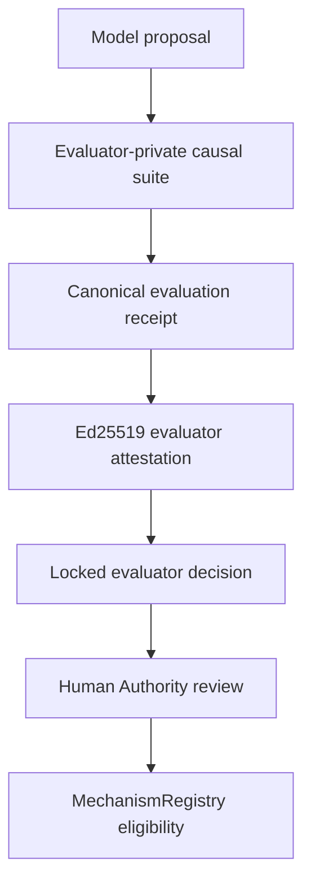

# WorldGen CausalBench Attestation v0.5

Status: implementation checkpoint; not a production deployment authorization.

## Trust milestone

This tranche changes the qualification path from an unbound score artifact into a fail-closed evidence chain:

No step in this chain exposes a canonical-state mutation function to the proposal producer. An eligible locked decision still requires Human Authority and does not itself commit or promote a mechanism.

## Repository reconciliation

The implementation branch reconciles three pieces of repository history:

- canonical upstream `main` at `a26e8ab52e42f5907a2ecebb4046642dc7ff0f5f`;
- the local TypeScript v0.4 checkpoint at `6befed55bb56203967b65f632220f62990f74373`;
- causal-kernel hardening from upstream branch `impl/worldline-4d-causal-kernel-v1` through `c2cfd34464db66ba3f5f75e25608a0cef0eb58fe`.

The expected `WorldGen-causalbench-v0.4.zip` and recorded hash were not present in the supplied files. The supplied Python-era archives and review notes were treated as legacy/adversarial evidence, not as the canonical implementation.

## Implemented controls

### Canonical evaluation receipt

`CausalBenchEvaluationReceipt` binds:

- candidate, producer, model, and model version;
- exact canonical hashes of the input state, proposal, and resulting state;
- public suite identity/version and opaque hidden-suite identifier;
- evaluator identity/version/config hash and policy version;
- regime coverage and complexity;
- causal blast precision/recall, pivotal-rule evidence, violations, forbidden mutations, regret, cost, latency, and retries;
- deterministic seed/stream and runtime/dependency-lock profiles;
- run/timestamp identity and requested/decided authority scope.

The receipt hash is `SHA256(canonical(receipt core))`. Receipt creation and verification reject malformed digests, non-canonical timestamps, invalid metric ranges, duplicate pivotal-rule references, inconsistent pivotal-rule recall, and invalid authority/isolation values.

### Evaluator attestation and locked decision

The evaluator signs the canonical attestation core with Ed25519. The locked evaluator binds its own configuration hash to the trusted public-key fingerprint, suite, policy, isolation mode, thresholds, and required regimes.

Promotion eligibility is rejected when any of the following differs from the attested run:

- candidate identity;
- input world;
- proposal;
- resulting state;
- evaluator/config/policy;
- suite/version/hidden-suite identifier;
- runtime isolation;
- required regime coverage;
- policy metrics, pivotal rules, violations, forbidden mutations, or regret.

`IN_PROCESS` evaluation cannot produce canonical-admission eligibility. Successful process/service evaluation produces only `ELIGIBLE_FOR_HUMAN_REVIEW`.

### Evaluator-private suites

The generic hidden-suite engine returns only a frozen descriptor and `evaluate` function. Rule identities are salted into opaque SHA-256 references. Evaluator-private reference definitions are separated into `evaluatorPrivateSuites.ts` so a deployment can package the engine surface separately from private cases.

The New Bedford reference suite covers:

- infrastructure capacity;
- incompatible ancestor events;
- stale source snapshots;
- hidden downstream dependencies;
- mechanism-version conflicts;
- wrong-worldline effects;
- legal-state mutations disguised as derived fields;
- geography overreach.

The adversarial World Integrity suite covers all ten requested categories: temporal contradiction, under-propagation, over-propagation, branch contamination, authority escalation, provenance forgery, stale-state mutation, reward hacking, replay mismatch, and mechanism applicability.

Abstention fails closed.

### Promotion coupling

The MechanismRegistry now fails closed when no trusted promotion-evidence verifier is configured. Its locked CausalBench adapter requires:

- the Human Authority approval to reference the exact evaluation receipt hash;
- the evaluated proposal to be canonically identical to the mechanism candidate;
- a valid locked decision with no rejection reasons;
- `ELIGIBLE_FOR_HUMAN_REVIEW` under canonical-admission scope.

Only then can a separate Human Authority approval promote the candidate.

### Regime-conditioned faithfulness map

The capability map stores evidence-backed observations in exact cells keyed by:

- model/provider/version;
- task family;
- capability dimension;
- regime (domain, geography, horizon, mechanism class, epistemic class);
- complexity.

It reports empirical cell statistics and evidence hashes without creating a global model score. Observation replacement is rejected and snapshots are content-addressed.

### Replay and deterministic branching

The RunGraph verifier now checks state, revision, receipt, base, predecessor, accepted-result, replay-result, branch-head, reachability, and cycle integrity. Import reconstructs a canonical store and requires a byte-identical export.

Branch derivation uses NFC-normalized labels, SHA-256 construction identity, and the explicit xoshiro stream. A trust script compares complete branch/revision/state output across fresh processes and scans the causal kernel for implicit `Math.random()` use and canonical-mutation bypass exports.

## Verification boundary and open work

The repository acceptance commands and exact evidence are recorded under `docs/evidence/`.

This checkpoint does **not** establish:

- production service isolation, secret management, signing-key custody, rotation, or revocation;
- confidentiality of held-out cases for a candidate that can read the entire source checkout (production cases must live in an evaluator-private deployment not mounted into candidate sandboxes);
- external model qualification results, calibrated faithfulness probabilities, municipal expert approval, or scientific validation;
- a security audit, dependency-vulnerability audit, deployment, merge, or production release;
- BuildGraph/Canon registration, which remains an explicit project-control follow-up.

The old `worldline-causalbench-receipt-v1` score artifact remains non-authoritative. Only a valid `worldgen-causalbench-evaluation-receipt-v1` plus trusted attestation and locked decision can serve as promotion evidence.
